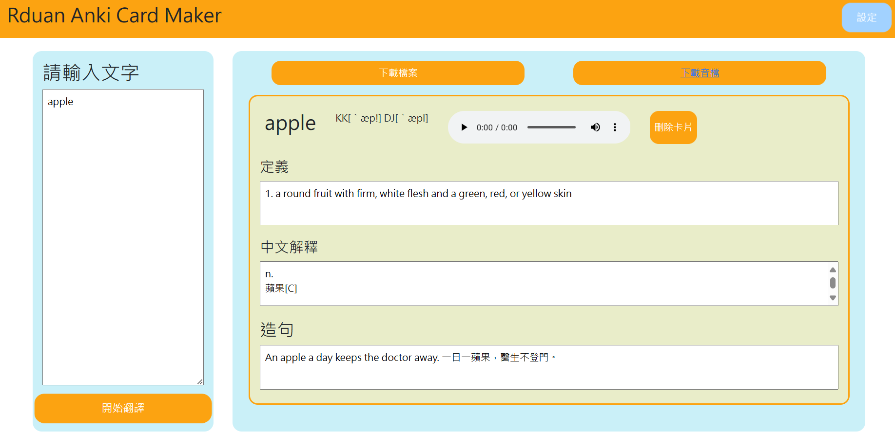

# RduanAnkiMaker 
> V.0.1.0

## 簡介
RduanAnkiMaker 是一個用來製作 Anki 卡片的工具，安裝完之後，只需要輸入您想輸入的音文字母，就可以自動製作含有英文定義、翻譯、造句、音訊等資料的 Anki txt 檔案，您只需要將其匯入到Anki即可

## 安裝以及啟動
>需要的指令如下
```
pip install -r requirements.txt
```
```
python App.py
```
此時您的終端機應該會有一段ip，請將其複製到瀏覽器中，然後按下Enter，即可進入到RduanAnkiMaker的主頁面，例如: http://127.0.0.1:5000/

## 使用方法
1. 在主頁面中輸入您想要查詢的單字，一次可以輸入多個單字
2. 按下查詢按鈕即可
3. 因為程式會自動去查詢單字的音訊，所以可能會需要一點時間

## 製作卡片種類
1. 製作卡片有兩種選項，一種是含有音訊檔，另外一種是沒有音訊檔
2. 如果您需要音檔，在瀏覽器顯示單字的時候，可以至本專案目錄底下的`media`資料夾中找到音檔
3. 此時您需要將其複製到Anki 的媒體資料夾，以下是官方的說明文件，找到您的Anki資料夾後，您必須進入到使用者資料夾(應該叫`使用者1`之類的)，進入之後選擇`collection.media`的資料夾，將檔案複製進去即可

https://docs.ankiweb.net/files.html
```
On Windows, the latest Anki versions store your Anki files in your appdata folder. You can access it by opening the file manager, and typing %APPDATA%\Anki2 in the location field. Older versions of Anki stored your Anki files in a folder called Anki in your Documents folder.

On Mac computers, recent Anki versions store all their files in the ~/Library/Application Support/Anki2 folder. The Library folder is hidden by default, but can be revealed in Finder by holding down the option key while clicking on the Go menu. If you're on an older Anki version, your Anki files will be in your Documents/Anki folder.

On Linux, recent Anki versions store your data in ~/.local/share/Anki2, or $XDG_DATA_HOME/Anki2 if you have set a custom data path. Older versions of Anki stored your files in ~/Documents/Anki or ~/Anki.
```

3. 需要Anki Txt 的檔案的話，請直按下下載即可，如果您先前搜尋的選項不包括音檔，此時的txt檔內就不會含有音訊標籤

## 匯入
1. 在匯入Anki 的時候，一定要將 "允許html"的功能打開，才能使卡片被正確渲染
   

# 注意事項
1. 本作者僅是在此紀錄程式碼，如果您取用之後，本作者並不付任何法律責任
2. 本專案採MIT授權，即便如此希望您不要將此專案用於商業用途
3. 歡迎各方高手一同精進此程式的功能
   

# Todo
1. 打包音訊成zip
2. 更多下載/輸出選項
3. 自動匯入到Anki
4. 打包成.exe